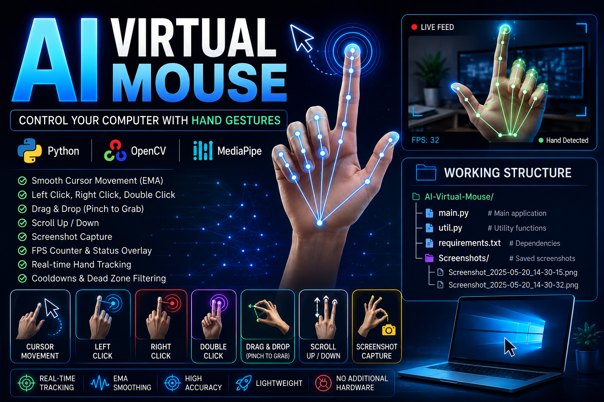
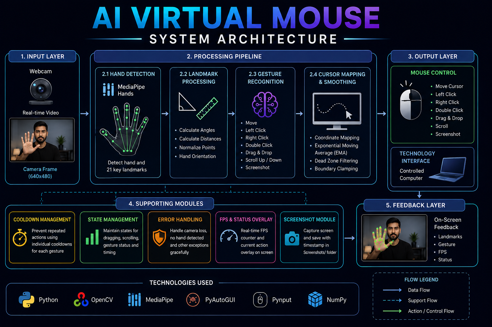
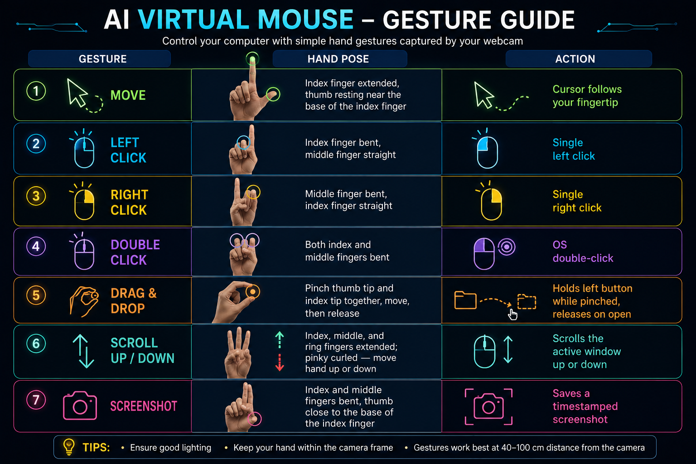

<p align="center">
  
</p>

# AI Virtual Mouse

Control your computer's cursor with nothing but your hand and a webcam. AI Virtual Mouse uses [MediaPipe Hands](https://developers.google.com/mediapipe) and OpenCV to track your hand in real time and translate a small vocabulary of gestures into full mouse functionality — movement, left/right click, double click, drag-and-drop, scrolling, and screenshots.

<p align="center">
  
  
  
  
  
</p>

---

## Table of Contents

- [Features](#features)
- [How It Works](#how-it-works)
- [Gesture Guide](#gesture-guide)
- [Demo Overlay](#demo-overlay)
- [Requirements](#requirements)
- [Installation](#installation)
- [Usage](#usage)
- [Configuration](#configuration)
- [Project Structure](#project-structure)
- [Troubleshooting](#troubleshooting)
- [Roadmap](#roadmap)
- [Contributing](#contributing)
- [License](#license)
- [Acknowledgments](#acknowledgments)

---

## Features

- 🖱️ **Full mouse functionality** — move, left click, right click, double click, drag & drop, scroll up/down, and screenshot capture
- 🎯 **Smooth, jitter-free cursor** — Exponential Moving Average (EMA) smoothing plus a configurable dead zone
- 🖥️ **Full-screen coordinate mapping** — reach every corner of your monitor without stretching your hand to the edge of the camera frame
- ⏱️ **Gesture cooldowns** — debounced clicks and screenshots so one gesture never fires multiple times
- 📸 **Timestamped screenshots** — auto-saved to a `Screenshots/` folder that's created for you
- 📊 **Live on-screen overlay** — FPS, current gesture, cursor status, tracking status, and screen resolution
- 🛡️ **Crash-resistant** — gracefully handles a missing camera, dropped frames, and a hand leaving the frame
- 🪶 **Minimal footprint** — just two Python files and a requirements list, no heavyweight framework or model training required

## How It Works

```
Webcam → MediaPipe Hand Detection → 21-Point Landmarks → Gesture Classification → Action Dispatch → OS Mouse Control
```

<p align="center">
  
</p>
<p align="center"><em>Figure — End-to-end working structure of the AI Virtual Mouse pipeline.</em></p>

1. **Capture** — OpenCV reads frames from your webcam and mirrors them for a natural, "look in a mirror" experience.
2. **Detect** — MediaPipe Hands locates a hand in the frame and returns 21 normalized landmark coordinates.
3. **Classify** — Simple, explainable geometry (joint angles and inter-landmark distances) determines which gesture, if any, is being made.
4. **Act** — The matched gesture triggers a cursor move, click, drag, scroll, or screenshot via PyAutoGUI/pynput.
5. **Display** — A diagnostic overlay is drawn on the video feed so you can see exactly what the system is detecting.

## Gesture Guide

<p align="center">
  
</p>
<p align="center"><em>Figure — Hand poses for each supported gesture.</em></p>

| Gesture | Hand Pose | Action |
|---|---|---|
| **Move** | Index finger extended, thumb resting near the base of the index finger | Cursor follows your fingertip |
| **Left Click** | Index finger bent, middle finger straight | Single left click |
| **Right Click** | Middle finger bent, index finger straight | Single right click |
| **Double Click** | Both index and middle fingers bent | OS double-click |
| **Drag & Drop** | Pinch thumb tip and index tip together, move, then release | Holds left button while pinched, releases on open |
| **Scroll Up / Down** | Index, middle, and ring fingers extended; pinky curled — move hand up or down | Scrolls the active window |
| **Screenshot** | Index and middle fingers bent, thumb close to the base of the index finger | Saves a timestamped screenshot |

> 💡 Tip: Keep gestures deliberate and hold them briefly — this gives MediaPipe a stable frame to classify and avoids accidental misfires.

## Demo Overlay

While running, the app overlays live diagnostics directly on the video feed:

```
FPS: 28.4
Gesture: Moving
Cursor: Active
Tracking: Locked
Screen Res: 1920x1080
```

## Requirements

- Python 3.9 or later
- A working webcam
- Windows, macOS, or Linux with a desktop environment (needed for cursor/screenshot control)

Python dependencies (see [`requirements.txt`](requirements.txt)):

| Package | Purpose |
|---|---|
| `opencv-python` | Video capture, frame processing, overlay rendering |
| `mediapipe` | Real-time hand landmark detection |
| `pyautogui` | Cursor movement, double-click, screenshots |
| `pynput` | Cross-platform mouse press/release and scroll events |
| `numpy` | Angle computation and coordinate interpolation |

## Installation

```bash
# 1. Clone the repository
git clone https://github.com/<your-username>/virtual-mouse.git
cd virtual-mouse

# 2. (Recommended) Create a virtual environment
python -m venv venv
source venv/bin/activate      # Windows: venv\Scripts\activate

# 3. Install dependencies
pip install -r requirements.txt
```

## Usage

```bash
python main.py
```

- A window titled **"AI Virtual Mouse"** will open showing your webcam feed with hand landmarks and the status overlay.
- Perform any gesture from the [Gesture Guide](#gesture-guide) to control your cursor.
- Press **`q`** with the video window focused to quit.

Screenshots are saved automatically to a `Screenshots/` folder created in the project directory, named like `Screenshot_2025-07-17_14-32-05.png`.

## Configuration

All tunable behavior lives as named constants at the top of `main.py` — no need to touch the gesture logic to adjust feel or performance.

| Constant | Default | Description |
|---|---|---|
| `SMOOTHING` | `0.7` | EMA smoothing factor for the cursor (higher = smoother but laggier) |
| `FRAME_MARGIN` | `100` px | Inset used when mapping the camera frame to the full screen |
| `CLICK_COOLDOWN` | `0.5` s | Minimum interval between left/right clicks |
| `DOUBLE_CLICK_COOLDOWN` | `1.0` s | Minimum interval between double clicks |
| `SCREENSHOT_COOLDOWN` | `2.0` s | Minimum interval between screenshots |
| `SCROLL_COOLDOWN` | `0.15` s | Minimum interval between individual scroll ticks |
| `SCROLL_SPEED` | `40` | Scroll units applied per tick |
| `DEAD_ZONE` | `4` px | Minimum cursor displacement required before moving |
| `SCROLL_DEAD_ZONE_PX` | `8` px | Minimum vertical movement required to register a scroll tick |
| `PINCH_THRESHOLD` | `40` | Thumb-tip/index-tip distance below which a pinch (drag) is registered |
| `CAMERA_WIDTH` / `CAMERA_HEIGHT` | `640 × 480` | Requested webcam capture resolution |
| `MIN_DETECTION_CONFIDENCE` / `MIN_TRACKING_CONFIDENCE` | `0.7` / `0.7` | MediaPipe Hands confidence thresholds |

## Project Structure

```
Virtual_Mouse/
├── main.py               # App entry point: video loop, gesture dispatch, OS control, overlay
├── util.py               # Pure helper functions: angles, distances, interpolation, EMA smoothing
├── requirements.txt      # Python dependencies
├── README.md             # This file
└── images/
    ├── banner.png            # Title banner
    ├── working-structure.png # System architecture / pipeline diagram
    └── gesture-guide.png     # Reference image for the Gesture Guide section
```

`util.py` has no dependency on OpenCV, MediaPipe, or OS-control libraries, so its functions can be unit-tested in isolation.

## Troubleshooting

| Problem | Likely Cause | Fix |
|---|---|---|
| `[ERROR] Could not open the camera` | Camera is in use by another app, or index `0` isn't your camera | Close other apps using the camera; try `cv2.VideoCapture(1)` |
| Cursor is jittery | Poor lighting or a noisy webcam | Increase `SMOOTHING` or `DEAD_ZONE` in `main.py` |
| Clicks fire repeatedly | Cooldown too short for your gesture speed | Increase `CLICK_COOLDOWN` / `DOUBLE_CLICK_COOLDOWN` |
| Cursor doesn't reach screen edges | `FRAME_MARGIN` too large | Lower `FRAME_MARGIN` |
| Gestures aren't recognized | Hand too close/far, poor lighting, or busy background | Improve lighting, use a plain background, stay ~40–70 cm from the camera |
| Low FPS | Camera resolution too high, or CPU-bound machine | Lower `CAMERA_WIDTH`/`CAMERA_HEIGHT`, or reduce MediaPipe `model_complexity` |

## Roadmap

- [ ] Adaptive/calibratable gesture thresholds per user
- [ ] Two-hand support with independent gesture roles
- [ ] On-screen gesture remapping UI
- [ ] Optional depth-camera support for more robust pinch detection
- [ ] Standalone packaged executables (Windows/macOS/Linux)

## Contributing

Contributions are welcome!

1. Fork the repository
2. Create a feature branch (`git checkout -b feature/my-feature`)
3. Commit your changes (`git commit -m "Add my feature"`)
4. Push to the branch (`git push origin feature/my-feature`)
5. Open a Pull Request

Please keep `util.py` free of OpenCV/MediaPipe/OS-control dependencies so its helpers stay easily testable.

## License

This project is licensed under the [MIT License](LICENSE).

## Acknowledgments

- [Google MediaPipe](https://developers.google.com/mediapipe) — real-time hand landmark detection
- [OpenCV](https://opencv.org/) — video capture and image processing
- [PyAutoGUI](https://pyautogui.readthedocs.io/) & [pynput](https://pynput.readthedocs.io/) — OS-level cursor and mouse control
